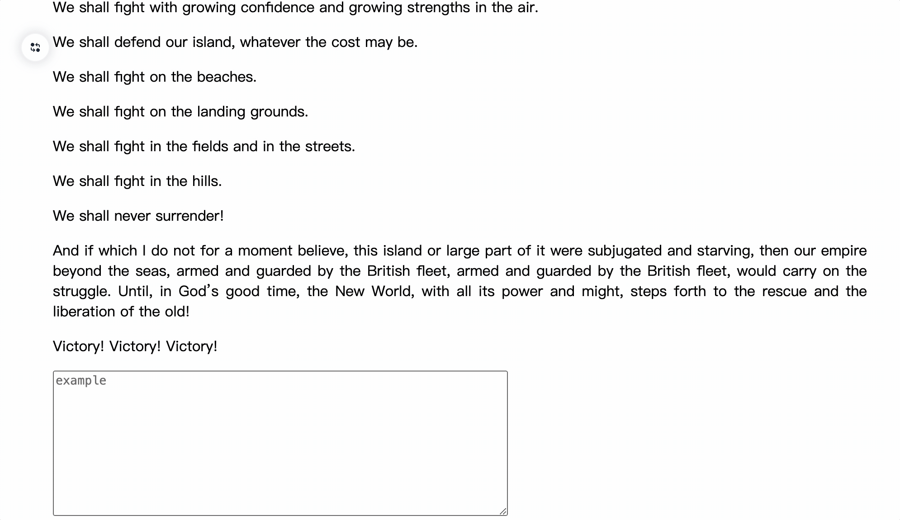
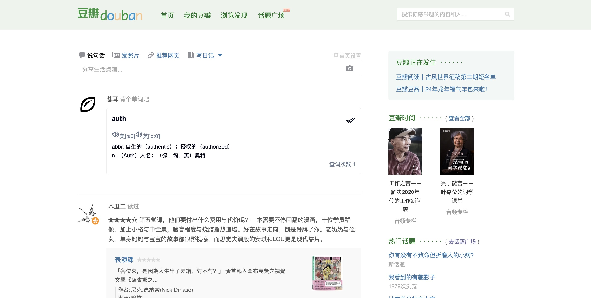

<div align="center">

<h1>Canger</h1>


> 在我小时候的记忆里，[苍耳](https://zh.wikipedia.org/wiki/%E8%8B%8D%E8%80%B3?useskin=vector)是一种恼人的叫不出名字的植物，但你几乎可以在任何地方看到它的身影。
> 每次从田埂里穿过之后，身上便会挂满这种植物，那时候我尽力想把它们清理干净，却怎么也想不到长大后有些东西你怎么拼命也抓不住。

</div>

> **Warning**
>
> 在 v1.0 版本之前，本项目仍处于开发阶段，不提供 Chrome 商店安装包，请自行下载并以开发者模式安装。

## 安装

克隆本项目，执行：

```
pnpm run build
```

在浏览器扩展程序界面点击加载已解压的扩展程序（注意打开开发者模式），加载 `dist` 目录即可。

目前仅支持 Chrome 浏览器（其他相同内核的浏览器应该也可以，未测试），Firefox 暂未测试。

## 介绍

Canger 帮助你学习和提升英语水平。在你阅读英语文章时，它可以帮助你快速的翻译单词和句子；在你回复帖子时，它可以帮助你翻译并不断优化你的表达。同时，查询过的单词将以单词卡片的形式出现在新标签页和一些常见的网站内容流中，帮助你你随时随地记单词。

## 功能速览

- ### 划词翻译、段落翻译


- ### 优化你的输入表达



- ### 背单词

可以在浏览器新标签页背单词。


或者在浏览网站时随时随地记单词。



---

请注意本项目的开源许可方式：GPL-3.0。
